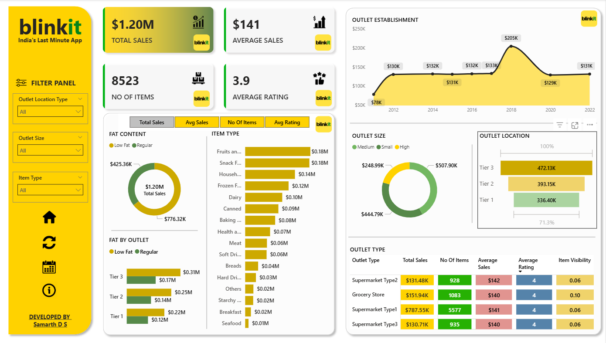
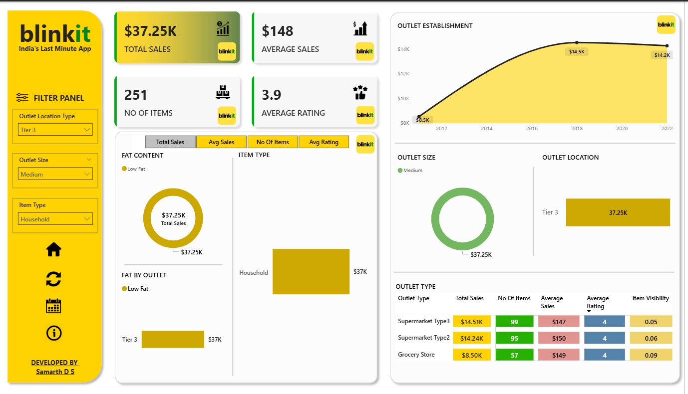
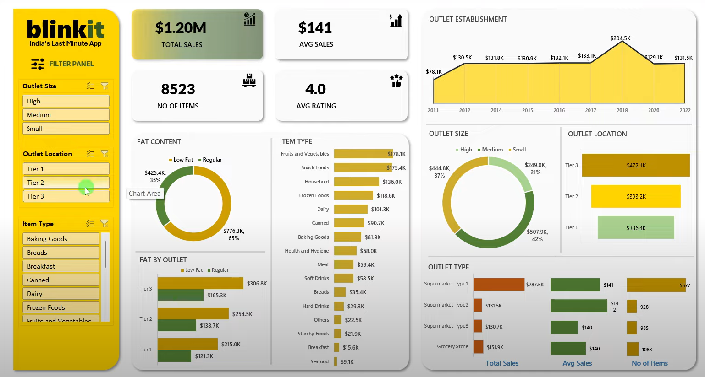
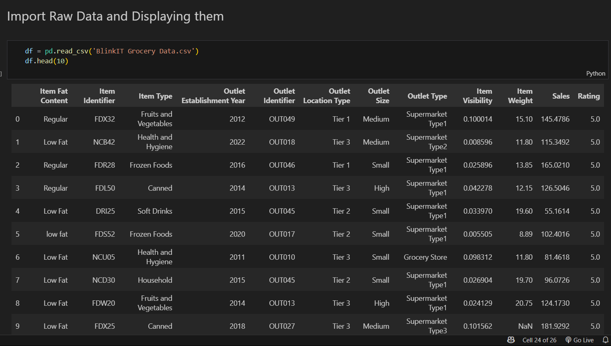
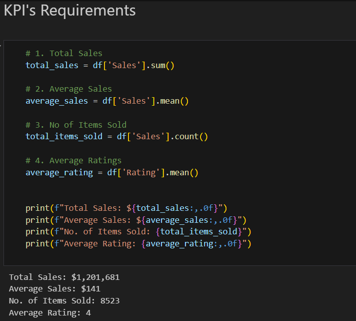
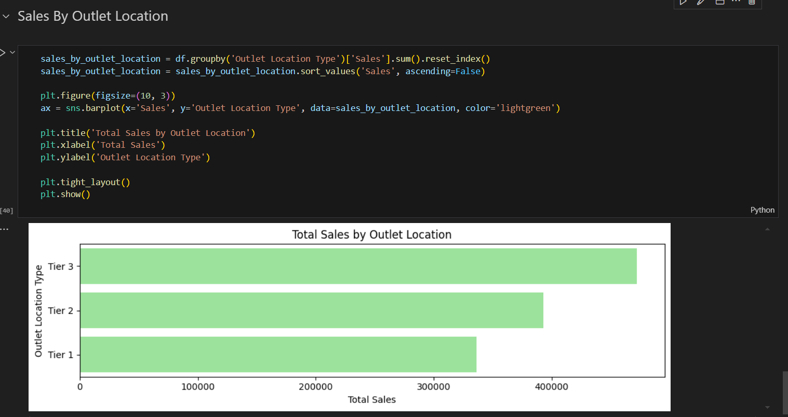
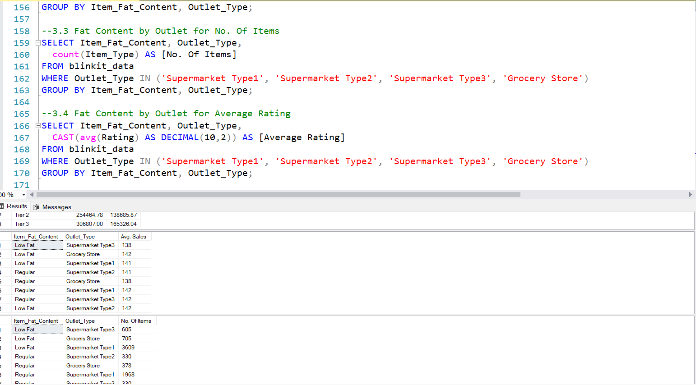

# 🛒 Blinkit Sales Analysis | Excel + SQL + Power BI Project 

A complete data analysis project simulating a real-world business case for Blinkit (a grocery delivery platform), covering data cleaning, transformation, and interactive dashboarding using Excel, SQL and Power BI.

---

## 📌 Project Objective

To analyse Blinkit's sales performance, customer satisfaction, and inventory distribution by identifying key business insights and optimisation opportunities using SQL and Power BI visualisations.

---

## 📊 Tools & Technologies

- **SQL Server** – Data import, cleaning, joins, aggregation, and pivoting
- **Power BI** – Dashboard creation, DAX measures, slicers, bookmarks
- **Excel** – Supplementary visualisations and data validation

---

## 📁 Dataset Overview

- **Rows:** 8,523  
- **Columns:** 12  
- Includes:  
  - `Item_Identifier`, `Item_Weight`, `Item_Fat_Content`, `Item_Type`,  
  - `Outlet_Identifier`, `Outlet_Establishment_Year`, `Outlet_Size`,  
  - `Outlet_Location_Type`, `Outlet_Type`, `Item_Visibility`, `Item_MRP`,  
  - `Item_Outlet_Sales`, `Customer_Rating`

---

## ✅ Key KPIs Tracked

- **Total Sales**  
- **Average Sales per Item**  
- **Number of Items Sold**  
- **Average Rating**

---

## 🔍 Business Insights & Analysis

- Sales distribution by **fat content**, **item type**, **outlet size**, **location**
- Customer behavior across **outlet establishment year**
- Identification of **high-performing outlet types**
- KPI breakdown across different **filter combinations**

---

## 📈 Dashboard Features (Power BI)

- Dynamic **filter panel** (Outlet Type, Size, Item Type)
- Navigation **buttons** (Home, Refresh, Calendar, Info)
- **Interactive visuals** (Pie charts, bar charts, line graphs)
- Conditional formatting and **KPI cards**
- Custom **branding & UI** consistent with Blinkit theme

 <!-- Replace with actual path -->









---

## 🧹 Data Preparation

- Cleaned inconsistent fat content labels (`LF`, `low fat` → `Low Fat`)
- Aggregated metrics using `GROUP BY`, `CASE`, and `PIVOT`
- Ensured clean joins and relationship models for Power BI
- Standardised fields to ensure consistent filtering and performance

---

## 📦 Project Folder Structure

```
├── SQL/
│ ├── SQLQuery1.sql
├── PowerBI/
│ └── blinkit_Dashboard_Analysis.pbix
├── Excel/
│ └── BlinkIT Grocery Data Analysis.xlsx
│ └── BlinkIT Grocery Data.xlsx
├── Images/
│ └── Avg Sales.png
│ └── background kpi.png
│ └── Blinkit-yellow-app-icon.png
│ └── Calendar.png
│ └── Clear Filter.png
│ └── database.png
│ └── Filter.png
│ └── Home.png
│ └── info.png
│ └── Items.png
│ └── rating (1).png
│ └── Sales.png
├── assets/
│ └── dashboard-1.png
│ └── dashboard-2.png
│ └── excel-1.png
│ └── excel-2.png
│ └── python-1.png
│ └── python-2.png
│ └── python-3.png
│ └── sql1.png
│ └── sql2.png
├── blinkit_analysis.ipynb
├── Report.pdf
├── README.md
```


---

## 💡 Key Learnings

- 70%+ of analytics work lies in **data cleaning & modeling**
- Understanding domain-specific business questions is critical
- Visualization is **not just decoration**, it's storytelling
- Interactivity adds **real value** to dashboards


---

## 📌 License

This project is for educational and portfolio purposes only.

